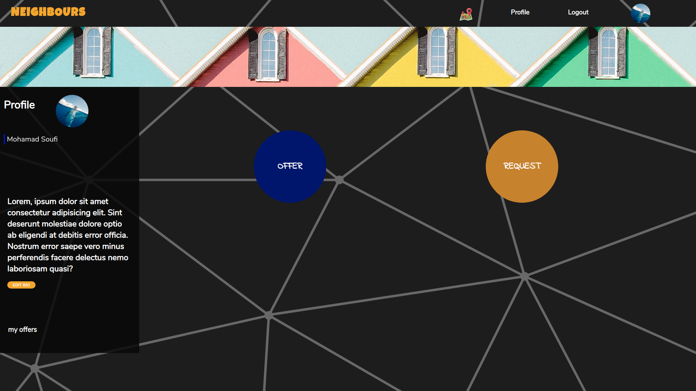
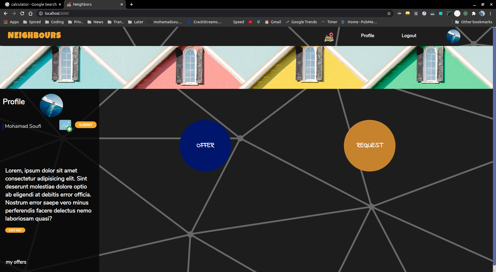
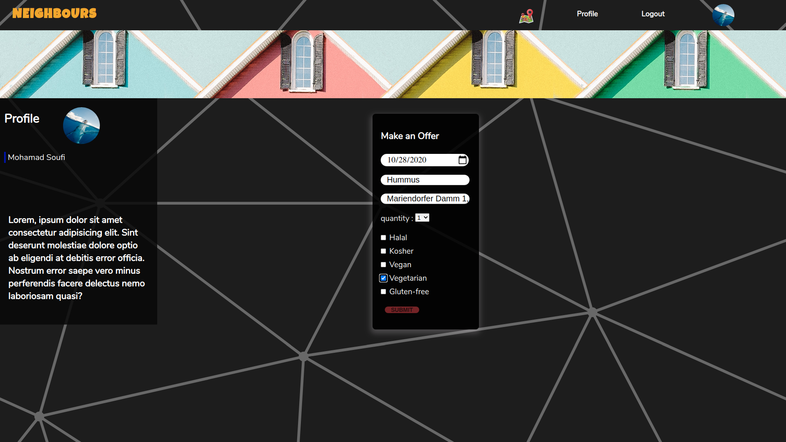
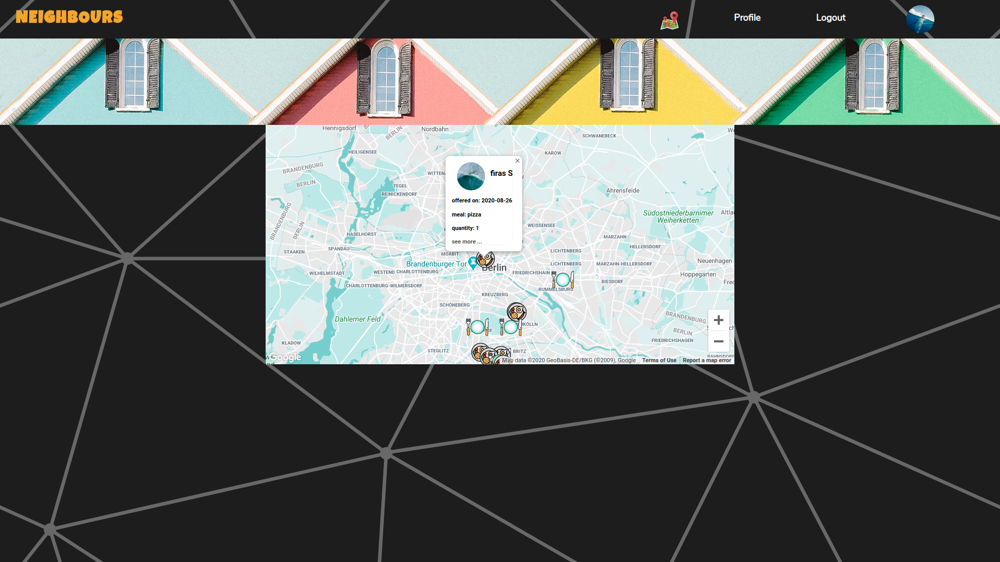
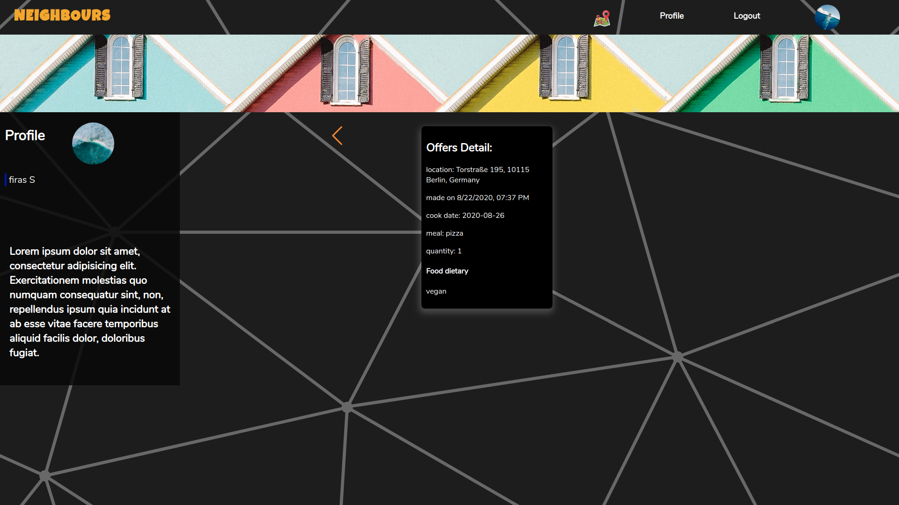
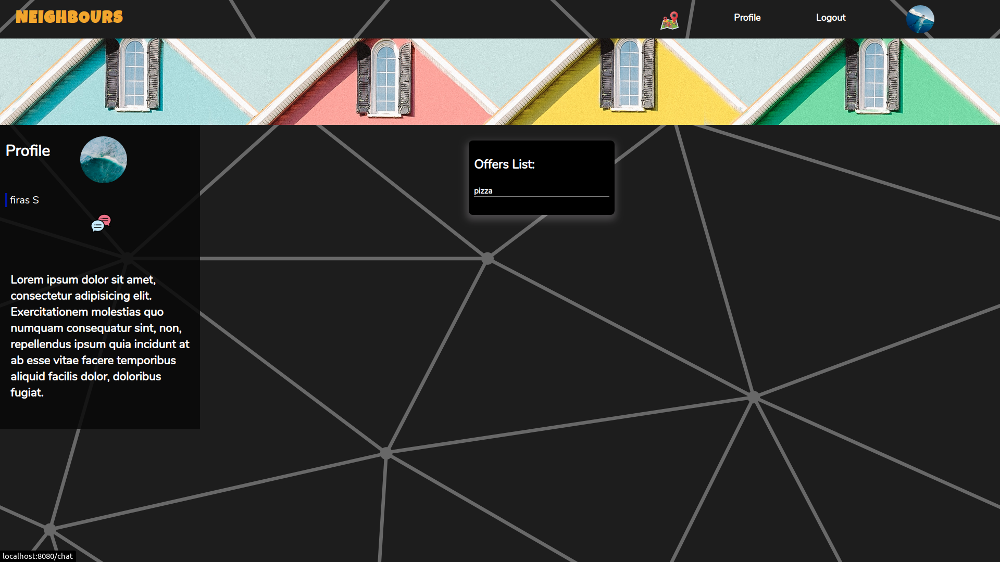
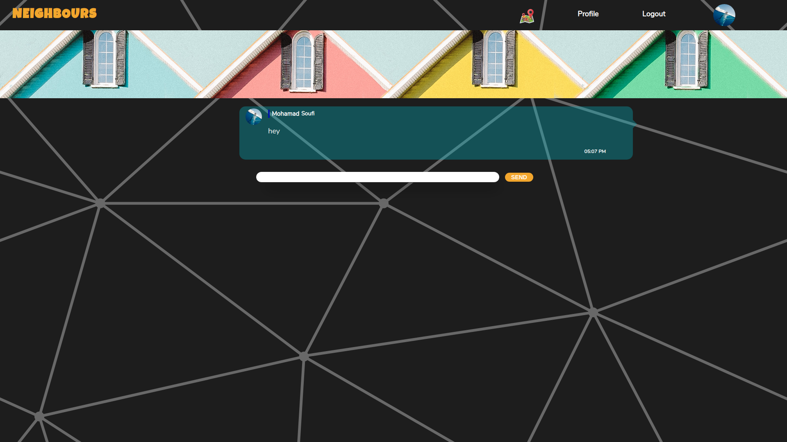

# Image Board

## About the project:

-   The project is an E-commerce where users can create a profile, make a food offer or request, and connect with other users.

## Note:

Prior to running the project, please ensure that you npm install all dependencies in order to successfully run the project on your computer.

#### npm start

Runs the app in the development mode.
Open http://localhost:8080 to view it in the browser.

The page will reload if you make edits.
You will also see any lint errors in the console.

#### node bundle-server

Runs the React App server.

## Technologies:

-   React
-   Redux
-   Node.js
-   Express
-   Socket.Io
-   PostgreSQL
-   AWS S3 - hosting photos

## Notes:

1. throughout the project I used Redux as a state manager,class components with local state, functional components with hooks.

2. Private chatroom:

-   messages are instantly received by the targeted user - using Socket.io
-   Messages form the same user are grouped into one block with time stamp.
-   Sending message by clicking or pressing enter.

# Features:

-   Single page application to enhance the user experience.
-   Users can edit their profile:
    1. add bio.
    2. upload a photo.
-   make, see and edit their offer/request meal details.
-   Users can chat in a private chatroom.
-   Users can look up other users around them using the map.

This is the Home page where the user can make either an food offer or a request and edit the profile's Bio.

The user can upload a personal image in the profile by clicking on the image default then on the add-image icon.

The offer/ request details can be added in this ticket, and then be submitted to the user's offers / requests.

This is the google map where the user can find other users' offers / request.
the icon on the map - where the user location is - is clickable, then it shows the user's details.

By clicking on the read more, it redirects to the targeted user's profile.

The offer / request details are listed in the details card with the option of clicking on the orange arrow to go back to see all of the other offers / requests.

In the offers list page, the user can click on the direct messaging icon to be able chat with the targeted user.

This is the chat page where users can directly communicate with each other.

